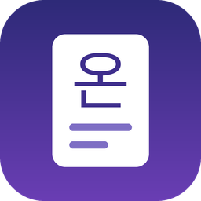
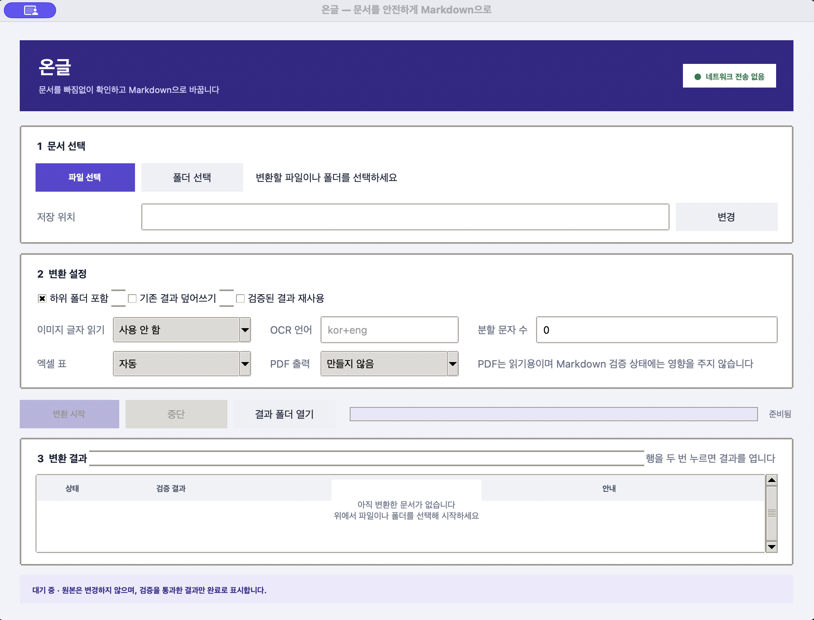
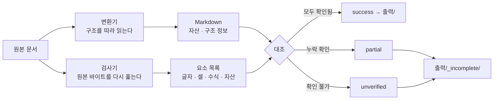
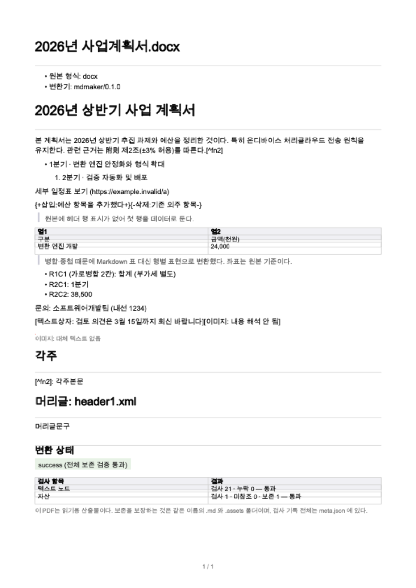

<div align="center">



# 온글 · Ongeul

**한글·오피스·PDF 문서를 로컬에서 Markdown으로.**

*변환했다고 해서 성공이라 말하지 않는다.*<br>
원본을 **변환기와 다른 경로로 한 번 더 읽어** 대조한 뒤에야 `success` 라고 쓴다.

<br>

[](https://github.com/wnsrud2002/ongeul/actions/workflows/test.yml)


<br>



</div>

<br>

## 이번 변경

- GUI를 문서 선택 → 변환 설정 → 결과 확인 흐름으로 정리하고, 한국어 옵션과 진행 상태를 바로 보이게 바꿨다.
- 배치 실행마다 `summary.json`을 원자적으로 기록해 파일별 상태·경고·출력 경로를 다른 도구에서도 읽을 수 있다.
- `--reuse`는 Markdown뿐 아니라 메타데이터·분할 파일·PDF까지 모든 산출물의 해시가 맞을 때만 재사용한다.
- 덮어쓸 때 이전 분할 파일이나 `_incomplete` 결과를 함께 치워 한 입력에 낡은 결과가 남지 않는다.
- 긴 한 줄도 `--split-chars` 한도 안에서 자르되, 다시 합치면 원문과 정확히 같도록 고쳤다.

<br>

## 왜 만들었나

문서를 AI에 넣기 전에 텍스트로 뽑아두려고 만들었다. 그런데 기존 변환기들은 **결과 파일이 나오면 성공**이라고 말한다.
표 안의 글자가 통째로 빠져도, 수식이 값만 남고 사라져도, 반복된 문장이 하나로 합쳐져도 그냥 "변환 완료"다.

온글은 그걸 하지 않는다. **변환한 결과를 원본과 대조해서, 통과한 것만 `success` 라고 쓴다.**

```sh
python3 -m pip install -r requirements.txt
python3 mdmaker.py "계약서.hwp" --out 출력                       # 명령줄
python3 mdmaker.py 입력폴더 --out 출력 --recursive --pdf result   # 폴더 통째로 + PDF까지
python3 gui.py                                                   # 창 화면
python3 build_app.py && open dist/온글.app                        # macOS 앱으로
```

외부 서비스 설정이나 API 키는 필요 없다. 외부 패키지는 엑셀용 `openpyxl`과 PDF 이미지·앱 아이콘용 `Pillow` 두 개다.

<br>

## 무엇이 다른가 — 두 갈래로 읽고 맞춰본다



같은 추출기로 두 번 확인하는 것은 보존의 증명이 아니다. 그래서 검사기는 변환기가 만든 결과물이 아니라 **원본 바이트**에서 목록을 만든다.

| 형식 | 변환 경로 | 검사 경로 (독립) |
| :--- | :--- | :--- |
| **DOCX / PPTX** | `zipfile` + `ElementTree` 구조 순회 | 원본 XML을 정규식으로 직접 스캔해 텍스트 노드 대조 |
| **XLSX** | openpyxl | 시트 XML·sharedStrings를 직접 파싱해 셀 값·수식·표시 형식 대조 |
| **HWP / HWPX** | 레코드 트리 / 구역 순회 | `PARA_TEXT` 레코드만 평평하게 훑어 글자 조각 대조 |
| **XLS** | LibreOffice 경유 | 원본 BIFF8의 공유 문자열 표를 직접 읽어 중간 변환 대조 |
| **PDF** | 내용 스트림 해석 | 스트림을 다시 훑어 글자 코드 수 대조 |

### 네 가지 상태 — "경고 붙였으니 성공"은 없다

| 상태 | 뜻 | 어디에 |
| :--- | :--- | :--- |
| ✅ `success` | 검사한 모든 요소가 결과에서 확인됨 | `출력/` |
| ⚠️ `partial` | 누락·변형이 **확인됨** | `출력/_incomplete/` |
| ❔ `unverified` | 잃은 것은 없지만 **확인할 수 없음** | `출력/_incomplete/` |
| ❌ `failed` · `unsupported` | 변환 실패 · 지원하지 않는 형식 | `출력/_incomplete/` |

종료 코드는 `0`(전부 success), `1`(하나라도 미달), `2`(인자 오류).

<br>

## 지원 형식

| 형식 | 상태 | 보존하는 것 |
| :--- | :---: | :--- |
| `.txt` `.md` `.csv` `.tsv` | ✅ | 인코딩 자동 판별(UTF-8/CP949), 셀 안의 구분자·줄바꿈·따옴표 |
| `.docx` | ✅ | 제목·목록·표·각주·미주·주석·머리글·텍스트상자·**변경추적**·취소선·색상 |
| `.xlsx` | ✅ | 전 시트(숨김 포함), **수식과 저장된 값 둘 다**, `0`/`FALSE`/빈 문자열/빈 셀 구분, 병합 범위, 표시 형식 |
| `.hwpx` | ✅ | `content.hpf` 순서대로 구역, 표·각주·수식·글상자·하이퍼링크 |
| `.hwp` (5.x) | ✅ | **CFB 리더와 레코드 파서를 직접 구현.** 표·메모·각주·그림·수식·필드 |
| `.pptx` | ✅ | 슬라이드 순서, 그룹 도형, 표, 발표자 노트, **차트에 저장된 수치** |
| `.xls` | ✅ | LibreOffice 경유 후 **원본 BIFF8을 직접 읽어** 글자·시트 대조 |
| `.pdf` | 🔸 | 본문·이미지·주석·링크. **구조상 항상 `unverified`** |
| 이미지 | 🔸 | 원본 보존 + OCR(선택). OCR 결과는 항상 검수 전 상태 |
| `.doc` `.ppt` `.rtf` `.odt` | 🔸 | LibreOffice 경유. 중간 변환 손실을 대조할 방법이 없어 `unverified` 상한 |

<br>

## PDF로도 뽑는다 — 읽기용 산출물

<div align="center">

</div>

```sh
python3 mdmaker.py 입력 --out 출력 --pdf result   # 변환 결과 → PDF
python3 mdmaker.py 입력 --out 출력 --pdf both     # 원본 문서도 → PDF (LibreOffice 필요)
```

`pdfwrite.py` 가 PDF를 **직접 쓴다.** 의존성이 없다.

- 시스템 한글 글꼴을 찾아 **쓰인 글자만 추려 넣는다** — 23MB 글꼴 → **414KB 부분집합** (복합 글리프가 참조하는 글자까지 따라간다)
- 글꼴 임베딩 허가(OS/2 `fsType`)를 확인하고, **본문 글자를 실제로 갖고 있는지** 먼저 본다
- 검사 기록은 날것의 JSON이 아니라 상태 배지와 `검사 항목 | 결과` 표로
- 둘째 쪽부터 문서 이름을 머리글로, 쪽번호는 `3 / 14`, 표가 쪽을 넘어가면 머리 행을 다시 그린다
- **만든 PDF를 우리 PDF 리더로 다시 읽어 검사한다.** 본문이 절반 넘게 다르면 그럴듯한 쓰레기를 남기지 않고 지우면서 이유를 적는다

> PDF는 **읽기용 산출물**이다. 보존을 보장하는 것은 `.md` 와 `.assets` 폴더이고, PDF는 사람이 보기 편하라고 만든 것이다. PDF 생성이 실패해도 변환 상태는 내려가지 않는다.

<br>

## 확인된 동작

<div align="center">

| 실제 문서 **526개** | | | |
| :---: | :---: | :---: | :---: |
| ✅ **264** success | ❔ **227** unverified | ⚠️ **31** partial | ❌ 실패 **0** |

</div>

```
.xlsx 81/81   .pptx 22/22   .hwpx 28/28   .xls 2/2   .hwp 94/96   .docx 33/34   .csv 4/4
.pdf  222 unverified + 31 partial + 4 unsupported(암호화)
```

success가 아닌 것의 사유는 **전부 특정돼 있다** — PDF 구조상 확인 불가(222) · PDF 폰트에 대응표 없음(31) · 암호화 PDF(4) · 이미지 내용(2) · 글자도 이미지도 없는 순수 도형(3).

테스트 **125개** 통과. 그중 **8개는 일부러 망가뜨린 결과가 `success` 로 올라가지 않는지** 보는 실패 검증이다.
CI는 **리눅스 · macOS · 윈도우 × 파이썬 3.11 / 3.12 / 3.13 = 9개 조합**에서 돈다.

<br>

<details>
<summary><b>실제 파일이 알려준 결함들 — 합성 샘플로는 하나도 잡히지 않았다</b></summary>

<br>

| 무엇 | 왜 못 잡고 있었나 |
| :--- | :--- |
| **HWP 표의 셀 문단이 `LIST_HEADER`의 자식이 아니라 같은 수준의 형제** | 이걸 몰라 표 안 글자 2천여 조각이 통째로 빠졌다. 고치자 hwp success가 1 → 65로 |
| **HWP 그림의 BinItem 색인이 오프셋 68이 아니라 71** | 문서에 적힌 계산으로는 68. 실제 파일 382건에서 전부 71이었고 68은 전부 0이었다 |
| **PDF `(글자) Tj` 의 문자열이 연산자로 오인됨** | PDF 문자열과 연산자가 둘 다 `bytes` 라서. 고친 뒤 추출량이 **1.2M → 4.8M자** |
| **엑셀 `cellXfs` 의 `<AlternateContent>` 래퍼** | openpyxl이 건너뛰어 스타일 색인이 밀리고 파일 8개가 **아예 열리지 않았다** |
| **병합 범위의 좌상단이 아닌 칸에 남은 값** | openpyxl이 가려서 통째로 사라졌다. 원본 XML에서 직접 건져낸다 |
| **zip 내부 경로를 OS 구분자로 생성** | 윈도우에서 `word\_rels\...` 를 찾아 관계가 전부 비었다. 맥·리눅스에선 우연히 맞아 안 드러났다 |
| **검사기가 "있는지"만 보고 "몇 번 있는지"는 안 봄** | 원문에 세 번 반복된 문장을 하나만 남겨도 통과했다 — 가이드가 금지한 중복 제거가 그대로 빠져나갔다 |
| **macOS 파일 이름이 NFD(자모 분해)** | PDF에서 "체육"이 "ㅊㅔㅇㅠㄱ"으로 그려졌다 |
| **리눅스에 한글 글꼴이 없으면 모든 한글이 빈 네모** | 멀쩡해 보이는 엉터리 PDF. 이제 글꼴이 본문을 덮는지 먼저 본다 |

</details>

<br>

## 쓰는 법

```sh
python3 mdmaker.py 입력 --out 출력 [옵션]
```

| 옵션 | 뜻 |
| :--- | :--- |
| `--recursive` | 하위 폴더까지 |
| `--overwrite` | 기존 결과 덮어쓰기 (기본은 충돌 보고) |
| `--encoding` | 텍스트/CSV 인코딩 지정 |
| `--xlsx-table auto\|md\|tsv` | 엑셀 표 출력 방식 |
| `--ocr off\|auto\|force`, `--ocr-lang` | 이미지 글자 읽기 (로컬 Tesseract 필요) |
| `--split-chars N` | 결과를 N자 기준으로 조각내고 **재결합이 원본과 같은지 검사** |
| `--reuse` | 내용 해시·옵션·버전이 모두 같고 결과까지 온전할 때만 건너뜀 |
| `--pdf result\|source\|both` | PDF도 만든다 |
| `--pdf-engine builtin\|soffice`, `--pdf-font` | 결과 PDF 생성기와 글꼴 |

출력은 이렇게 놓인다.

```
출력/계약서.hwp.md
출력/계약서.hwp.pdf              --pdf result 일 때
출력/summary.json                 파일별 상태·경고·출력 경로를 모은 배치 결과
출력/계약서.hwp.assets/
    meta.json                   보존 검사 기록 · 구조/서식 정보 · 처리 정보
    media/                      원본 바이트 그대로의 이미지·첨부
출력/_incomplete/               검증을 통과하지 못한 결과 (상태 표시와 함께)
```

> 이미지는 링크만으로 AI에 내용이 전달되지 않는다. 결과 `.md` 만 보내면 그림은 빠진 채로 간다.

<br>

## 만든 방식

외부 패키지는 `openpyxl`(엑셀)·`Pillow`(PDF 이미지 복원과 앱 아이콘)만 쓴다.

| 파일 | 하는 일 |
| :--- | :--- |
| `mdmaker.py` | 형식별 변환기, 보존 검사, CLI |
| `pdf.py` | **PDF 저수준 리더** — 객체·스트림·필터·폰트 인코딩 |
| `pdfwrite.py` | **PDF 쓰기** — TrueType 부분집합 추출, Type0 임베딩, 마크다운 배치 |
| `hwp5.py` | **HWP 5.x 저수준 리더** — CFB(OLE) 복합 파일과 레코드 스트림 |
| `xls.py` | 구형 엑셀(BIFF8) 문자열·시트 이름 리더 |
| `gui.py` | 창 화면 (tkinter). CLI와 같은 변환 경로를 쓴다 |
| `build_app.py` | macOS `.app` 묶음 만들기 (iconutil + plistlib) |
| `test_mdmaker.py` | 테스트 125개 (표준 `unittest`, 프레임워크 없음) |

```sh
python3 -m unittest discover -s . -p 'test_*.py'
```

실제 문서로 확인하고 싶으면 `samples/` 에 파일을 넣고 돌리면 된다. 그 폴더는 `.gitignore` 로 막혀 있어 저장소에 올라가지 않는다.

<br>

## 오프라인

변환 중 네트워크를 쓰지 않는다. 문서 안의 외부 링크·이미지 주소는 **보존하되 가져오지 않는다.**
`socket` 과 `urlopen` 을 막은 상태에서 모든 형식이 변환되는지 테스트로 확인한다.

패키지 설치에 인터넷이 필요한 것과 변환 중 외부 API를 쓰는 것은 별개다. 온글은 후자를 하지 않는다.

<br>

## 한계 (숨기지 않는 것)

- **PDF는 설계상 항상 `unverified` 다.** PDF 파일은 문단·표·읽기 순서를 담지 않는다. 글자 좌표로 줄을 재구성할 뿐이라 자동으로 보존을 확정할 수 없다.
- **보호된 문서는 우회하지 않는다.** 암호·배포용·DRM 문서는 식별만 하고 `unsupported` 로 보고한다.
- **OCR 결과는 검수 전 상태다.** 숫자·고유명사·표에 오류가 있을 수 있어 사람이 보기 전에는 확정된 내용이 아니다.
- 검사는 텍스트·셀 값·자산 바이트 기준이다. 글꼴·정렬 같은 서식 전반은 검사 대상이 아니다.
- 토큰 수가 아니라 **문자 수**만 센다. 분할 단위도 문자 기준이다.
- PDF 내보내기는 **변환 산출물이지 보존 검증 대상이 아니다.**

<br>

## 라이선스

MIT. 자유롭게 쓰되 보증은 없다. 자세한 내용은 [LICENSE](LICENSE).

<div align="center">
<br>
<sub><b>온전한 글.</b> 변환했다고 성공이라 하지 않는다.</sub>
</div>
